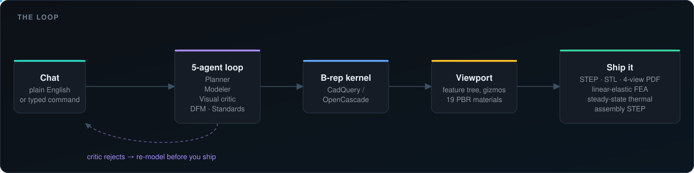
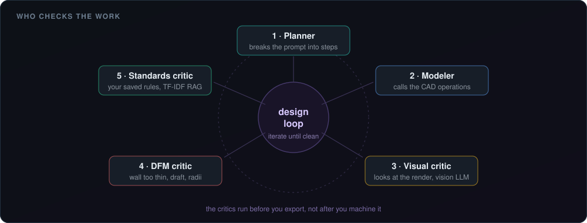
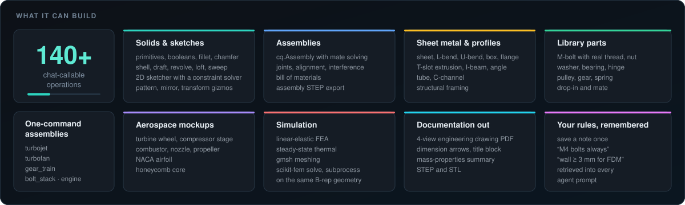
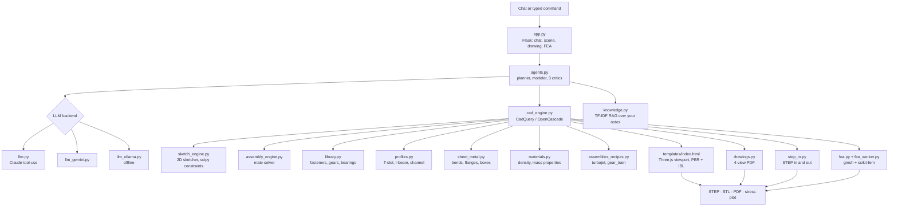

<div align="center">



<br>

[](https://www.python.org/)
[](https://cadquery.readthedocs.io/)
[](https://scikit-fem.readthedocs.io/)
[](https://github.com/Samarjithbiswas/ChatCAD/releases/latest)
[](LICENSE)
[](#pick-an-llm-optional)

**[Download for Windows](https://github.com/Samarjithbiswas/ChatCAD/releases/latest)**
&nbsp;·&nbsp; [Pitch deck](./PITCH.md)
&nbsp;·&nbsp; [How it works](#the-loop)
&nbsp;·&nbsp; [90-second demo](#90-second-demo)
&nbsp;·&nbsp; [Architecture](#architecture)

</div>

---

## What it does

Describe a part in plain English, or in terse typed commands, and get an exportable
**STEP / STL / engineering-drawing PDF** in seconds. The geometry is real B-rep, so you
can hand it to a CAM package or a machinist. Then mesh and solve it in the same tool.

No API key required: it runs in typed-command mode out of the box, or against a free
local Ollama model with no network at all.

## The loop

<div align="center">

</div>

Most AI CAD demos stop at "looks like a part". The difference here is what happens after
the geometry exists: five agents inspect it, and then the same geometry gets meshed and
solved.

<div align="center">

</div>

The visual critic actually looks at a render through a vision model. The DFM critic
catches "wall too thin" before you ship, not after. The standards critic reads the notes
you saved once and applies them to every part after that.

## What it can build

<div align="center">

</div>

## Why bother

| | |
|---|---|
| **Real B-rep, not mesh triangles** | Output goes to CAM or a machinist. Mesh-only tools cannot. |
| **Critics run before export** | A design loop that rejects its own bad output is worth more than a faster generator. |
| **Bring your own LLM** | Anthropic, Gemini, local Ollama, in-browser WebLLM, or none at all. |
| **Simulation on the same geometry** | Linear-elastic and steady-state thermal, on the B-rep you just made, not a re-import. |
| **Drawings, not just models** | 4-view PDF with dimensions, title block and mass properties. |
| **It remembers your rules** | Saved notes are retrieved into every agent prompt with TF-IDF. |

## Quick start

### Windows

1. Download [`ChatCAD_Setup.exe`](https://github.com/Samarjithbiswas/ChatCAD/releases/latest)
2. Double-click. One-time Miniforge and CadQuery install, about 5 minutes and 1.5 GB.
3. Launch from the desktop shortcut. Your browser opens at `http://127.0.0.1:5000/`.

### From source

```powershell
conda create -n chatcad python=3.11 -y
conda activate chatcad
conda install -c conda-forge cadquery -y
pip install -r requirements.txt
python app.py
```

### Pick an LLM (optional)

| Backend | How | Cost |
|---|---|---|
| **Anthropic Claude** | paste an `sk-ant-...` key in settings | best quality, about half a cent per part |
| **Google Gemini** | paste an `AIza...` key from aistudio.google.com | free tier |
| **Local Ollama** | install Ollama, then `ollama pull qwen2.5` | free, fully offline |
| **In-browser WebLLM** | pick a `browser:` model from the dropdown | free, no key, 600 MB one-time |
| **None** | typed-command mode | works out of the box |

Keys are sent with the request and are not stored server-side. They live in your
browser's `localStorage`.

## 90-second demo

```text
1. Launch                       clean viewport, feature tree, view cube
2. bolt_stack demo M8 15 60     plate + 2 washers + threaded M8 bolt + hex nut
3. right-click bolt             Mirror about XY, second bolt appears
4. Render tab                   Polished steel, apply to all
5. File tab                     Drawing PDF, 4-view drawing downloads
6. Simulate tab                 click the plate, Run FEA, real stress in 8 s
7. Design Agent mode            "turbojet engine, 200 mm fan, 600 mm length"
                                19 sub-parts build themselves, critic checks
                                each milestone
8. Render tab                   Brushed aluminium + outdoor sky, catalog shot
```

## Architecture



## Pricing (intent)

| Tier | Price | What you get |
|---|---|---|
| **Open source** | $0 | Full feature set, runs locally, MIT |
| **Pro** (planned) | $49/mo | Hosted instance, priority support, custom knowledge base |
| **Team** (planned) | $499/mo | Shared knowledge base, multi-user sessions, audit logs |
| **Enterprise** (planned) | custom | On-premise, SAML/SSO, domain fine-tune |

## What this is, and what it is not

**It is** a chat-driven CAD tool with real B-rep output, real FEA, and real engineering
drawings. Comparable in spirit to a text-to-CAD demo, with broader operation coverage
and a multi-agent design loop on top.

**It is not** a SolidWorks, Onshape or Fusion 360 replacement. Those kernels carry 25 to
35 years of customer-validated edge cases. This does not have that history. The wedge
here is speed from a chat prompt to a serviceable part, not authoring 50,000-part
assemblies with full tolerance stack-ups.

**It will be** whatever the first ten paying customers say it needs to be.

## License

MIT. See [LICENSE](LICENSE).

---

<div align="center">

Built by **[Samarjith Biswas, Ph.D.](https://samarjithbiswas.com)**

Mechanical engineering &nbsp;·&nbsp; acoustic metamaterials &nbsp;·&nbsp; agentic AI for design

</div>
